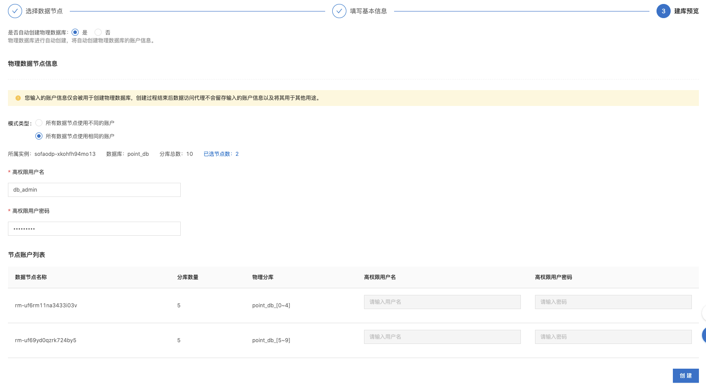
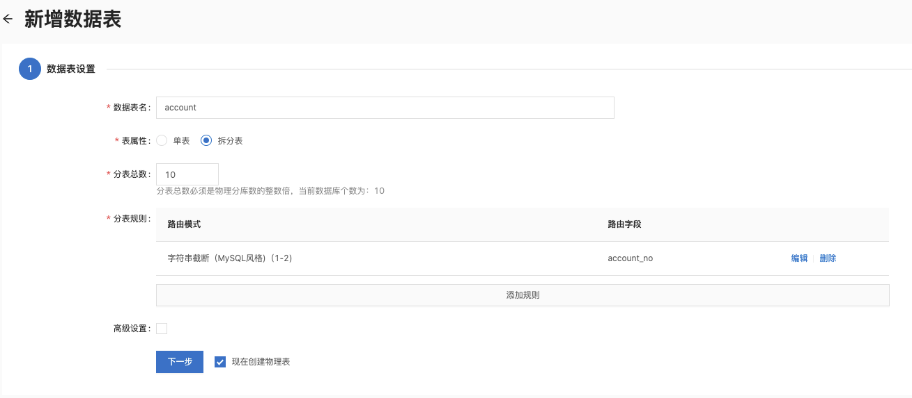
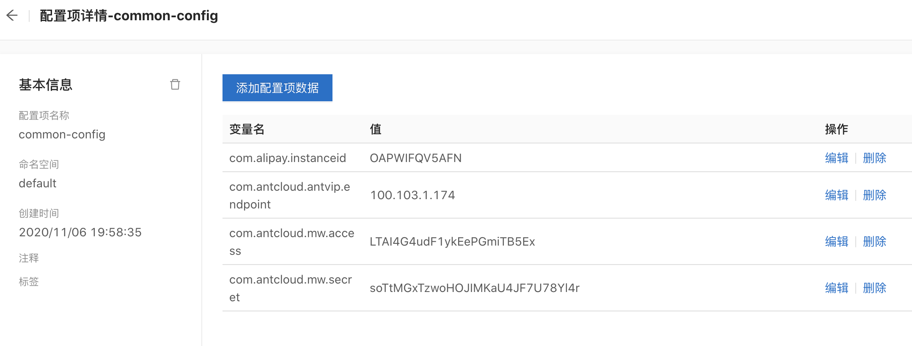
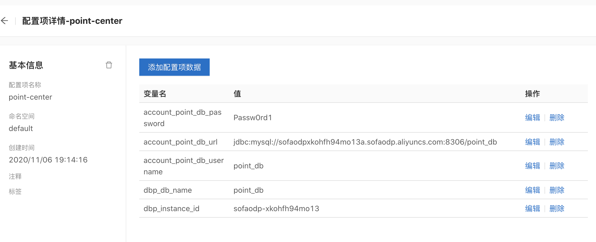
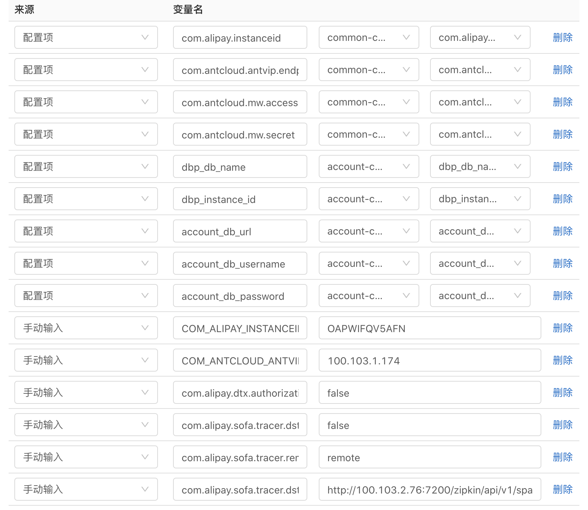
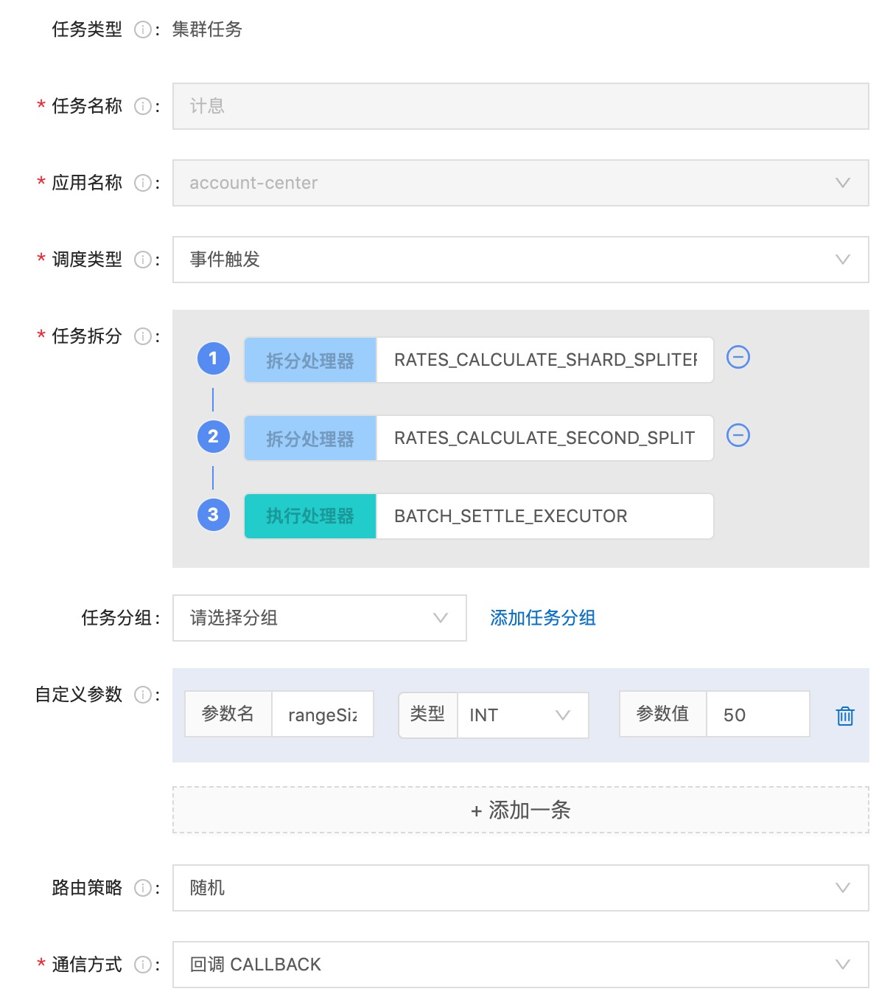
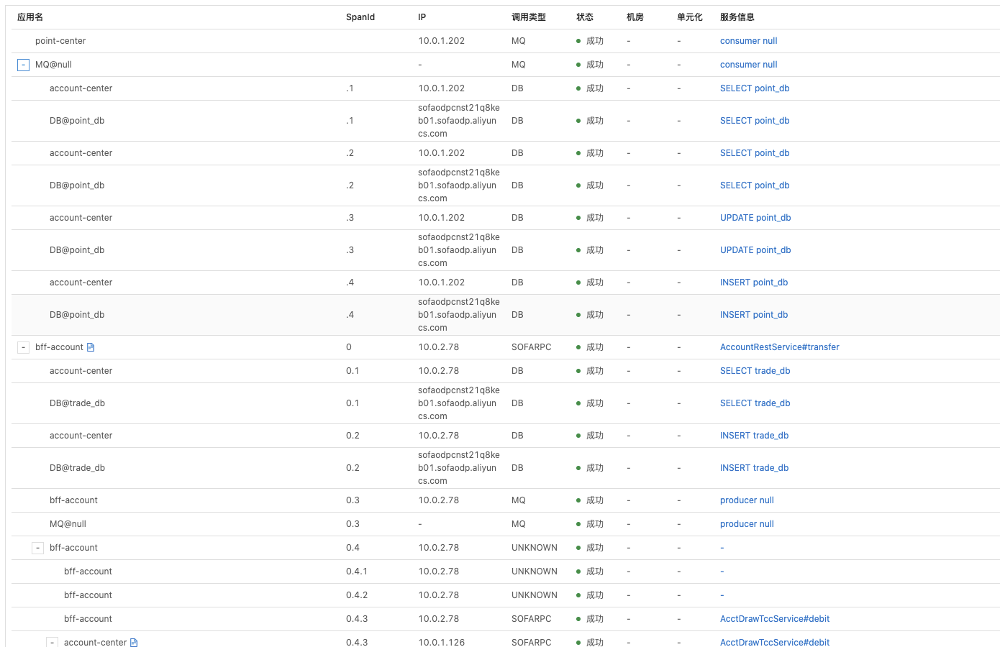
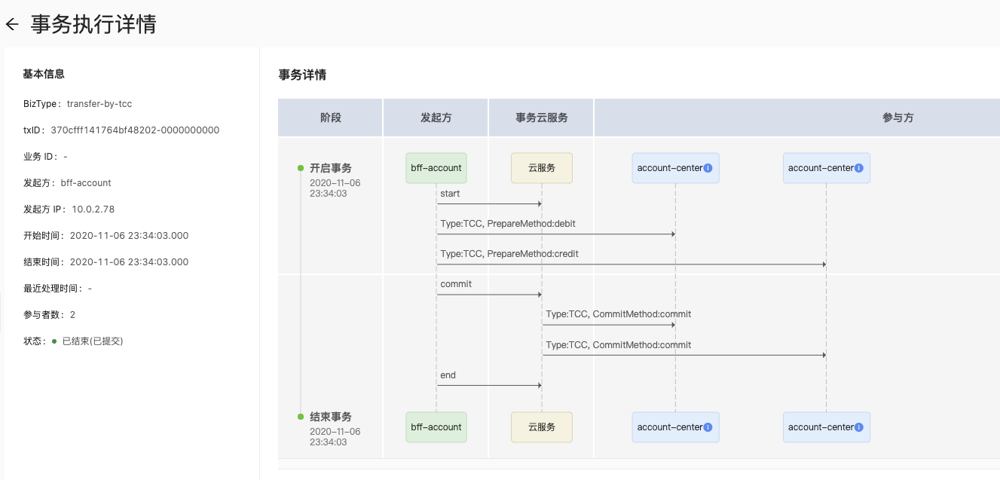

## showcase 部署说明

### 前提条件
- 本地开发环境搭建参考：[安装JDK和Maven](https://help.aliyun.com/document_detail/133192.html)
- 云环境准备工作参考：1. [开通SOFAStack服务](https://help.aliyun.com/document_detail/137419.html)；2. [工作空间准备](https://help.aliyun.com/document_detail/134381.html) 3. [创建应用元数据](https://help.aliyun.com/document_detail/134384.html?)

### 部署步骤

#### 创建RDS和数据库访问代理ODP

首先创建RDS数据库（注意不要用高版本，ODP不支持），注意确保创建的RDS数据库和SOFA的工作空间在同一个AZ/VPC

- 创建2个RDS数据库，在每个RDS实例的账户管理下，需要创建高级权限用户（ODP 建库需要高权账户）
- 测试登录数据库，激活账号，登录过程中需要设置白名单
- 修改每个实例的白名单设置，修改default从127.0.0.1为0.0.0.0/0，允许所有IP访问，如果需要可以放开公网IP访问

确认ODP实例创建完成，并导入RDS数据库和创建应用数据库

在SOAF -> ODP -> 运维 -> 物理数据节点，导入创建好的RDS数据库；创建数据库 account_db, point_db, trade_db，选择导入的RDS数据库，设置编码、分库数、密码。



创建数据表：account，dtx_tcc_action，account_transaction，创建过程中最后一步使用 DDL 脚本里面的相应语句创建table：

```
- account-db: /account-center/account-center-dal/src/main/resources/sql/initDB.sql
- point-db: /point-center/point-center-service/src/main/resources/sql/initDB.sql
- trade-db: /bff-account/bff-account-service/src/main/resources/sql/initDB.sql
```

示例如下：



#### 应用构建和镜像推送

部署应用前，需要进行应用构建，并构建和推送镜像。

- 使用maven命令：mvn package -Dmaven.test.skip=true
- 使用docker build、push 构建推送镜像
- 确保你账户下的容器镜像服务开通，并且创建了命名空间和镜像库，根据容器镜像服务说明执行docker login

```
在account模块下
mvn package -Dmaven.test.skip=true
mvn install -Dmaven.test.skip=true
docker build . -t registry.cn-shanghai.aliyuncs.com/demo-ns/account-center:v1
docker push registry.cn-shanghai.aliyuncs.com/demo-ns/account-center:v1

在point-center模块下
mvn package -Dmaven.test.skip=true
docker build . -t registry.cn-shanghai.aliyuncs.com/demo-ns/point-center:v1
docker push registry.cn-shanghai.aliyuncs.com/demo-ns/point-center:v1

在bff-account模块下
mvn package -Dmaven.test.skip=true
docker build . -t registry.cn-shanghai.aliyuncs.com/demo-ns/bff-account:v1
docker push registry.cn-shanghai.aliyuncs.com/demo-ns/bff-account:v1
```

#### 应用配置项

应用部署前完成配置项

- 给每个应用分别配置配置项，键值对参考各个application.properties，也包括公有云四元组
- 可以使用secret，对于密码等敏感数据






```举例
# dbp configs
dbp_db_name=逻辑数据库名称，比如account_db
dbp_instance_id=odp实例名称

# db connection configs
account_point_db_url=jdbc:mysql://odp链接信息:8306/逻辑数据库名称比如account_db
account_point_db_username=逻辑数据库的用户名
account_point_db_password=逻辑数据库的密码
```


#### 配置MQ

创建topic和group

```
Topic: ACCT_POINT
消息类型：事务型消息
Group ID：GID_SHOWCASE
```

#### 部署应用

应用部署
- 管理应用，创建各个应用：account-center, point-center, bff-account
- 容器应用服务，创建应用进行发布，配置变量，确保给bff-account创建服务，**TODO 需要说明如何发布**
- 创建网络服务，使用公网SLB

变量配置如下：



#### 配置DRM

```
域：showcase
应用：point-center
类标识：com.aliyun.gts.financial.showcases.sofa.dynamic.PointConfig
属性：pointValue
```


#### 配置任务调度

配置任务调度

```
类型：集群任务
任务名称：结息
应用名称：account-center
调度类型：事件触发/Cron都行
拆分处理器（第一层）：RATES_CALCULATE_SHARD_SPLITER
拆分处理器（第二层）：RATES_CALCULATE_SECOND_SPLITER
执行处理器：BATCH_SETTLE_EXECUTOR
自定义参数：rangeSize，INT，5
通信方式：CALLBACK
```



### 验证

- 初始化数据：GET http://139.196.58.242:8341/webapi/account/init/XXXX（ip地址替换为bff-account相应的网络服务地址信息），其中XXXX可以为任意4个数字，会作为账号的组成部分（8位长度，格式为[00-99]XXXX[00-99]），默认会创建10000个账号，余额均为10000
- 使用postman测试
- 转账：http://139.196.58.242:8341/webapi/account/transfer/tcc（ip地址替换为bff-account相应的网络服务地址信息），用post方法，进行转账操作，注意替换下面数据中的账号信息和金额

{"requestId":"00000000000001","fromAccountNo":"20666600","toAccountNo":"20666601","transferAmount":100}

- 查账：GET http://139.196.58.242:8341/webapi/account/balance/00800001（ip地址替换为bff-account相应的网络服务地址信息），注意替换账号信息
- 查积分：GET http://139.196.58.242:8341/webapi/account/point/00800001（ip地址替换为bff-account相应的网络服务地址信息），注意替换账号信息

- 分布式链路追踪验证



- 分布式事务验证


